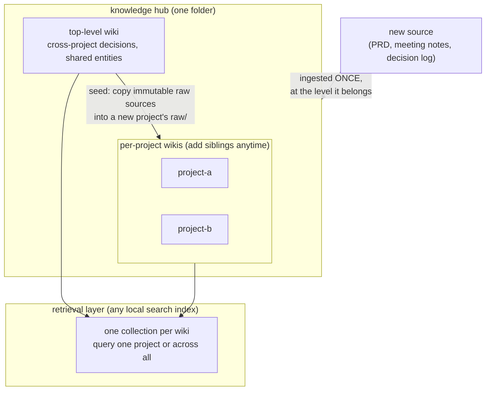
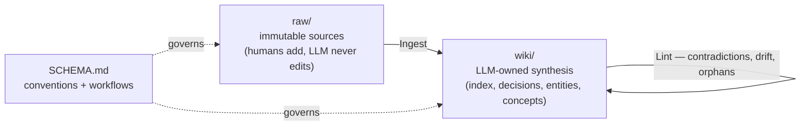

# LLM Wiki Starter Kit

A scaffold for an **LLM-maintained project wiki** — built on
[Andrej Karpathy's *LLM Wiki* idea](https://gist.github.com/karpathy/442a6bf555914893e9891c11519de94f),
extended into a **multi-project knowledge system**: one top-level wiki for cross-project
truth, one wiki per project/segment, and a retrieval layer over all of them.

Use it when a program is too big for one document — e.g. a 75-page PRD that stakeholders
want segmented into projects — and you want each segment to have its own living knowledge
base without forking the truth.

## The pattern in one diagram



Inside every wiki, the Karpathy loop:



## The two rules that keep it from forking

1. **A source is ingested once, at the level it belongs.** Segment wikis are seeded by
   copying **immutable raw sources** into their `raw/` — never by copying synthesized
   wiki pages. Raw copies can't drift; synthesized copies always do.
2. **Cross-project decisions keep one home.** One decision register, one ID space, at the
   top level. Project wikis **link** to those decisions (or re-state them as tagged
   `derived` renders) — they never re-author them.

## What's in the kit

```
README.md          — this file
HUB.md             — the multi-project extension: segmenting, seeding, retrieval
SCHEMA.md          — the wiki's operating manual (conventions + Ingest/Query/Lint)
ROADMAP.md         — process spine template (sequencing + spec index)
specs/             — per-feature build-contract templates
raw/INDEX.md       — source catalog template (provenance ledger)
wiki/              — starter registers: index, decisions, open questions, requirements
.wiki/             — operational logs (ingest log, lint reports)
```

## Quickstart

1. Copy this kit into a new folder — one per project/segment.
2. Fill in the **Project config** block at the top of `SCHEMA.md`.
3. Drop your sources into `raw/` and register each in `raw/INDEX.md`.
   Seeding from a parent program? Copy the relevant **whole source documents** from the
   top-level `raw/` (see `HUB.md` for why whole docs beat excerpts).
4. Point your LLM agent at `SCHEMA.md` and run **Ingest** on each source.
5. Let the entity/concept page set emerge from your sources — don't force another
   project's page structure onto a new domain.

## Credits

The raw/wiki/schema three-layer pattern and the Ingest/Query/Lint loop are
[Karpathy's](https://gist.github.com/karpathy/442a6bf555914893e9891c11519de94f).
The multi-project hub, raw-layer seeding, one-home decision discipline, provenance/lint
conventions, and this scaffold are the extension.
